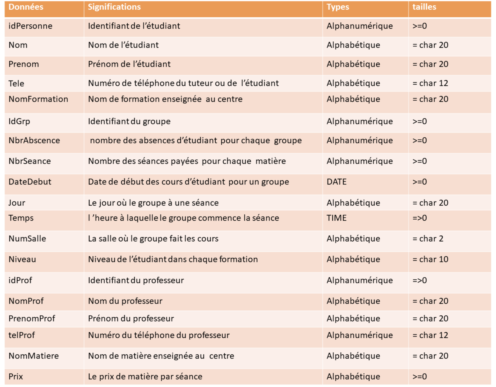
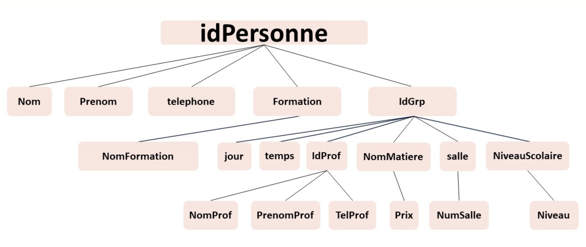
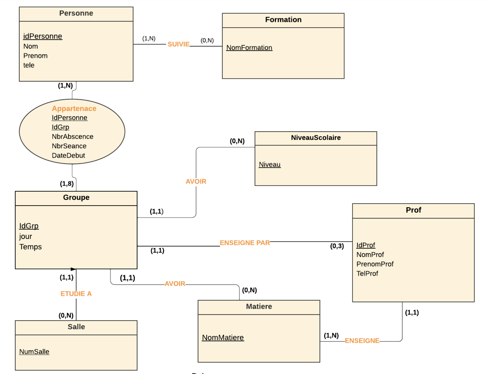
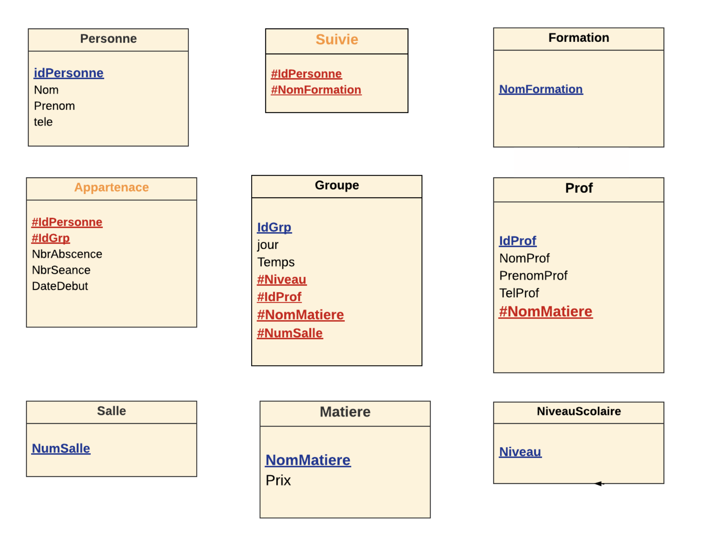

# Centre de Formation

Ce projet est développé dans le cadre du module Systèmes d’Information & Bases de Données Relationnelles pour les étudiants de Génie Informatique à l'ENSA Khouribga. Il s'agit d'une application web destinée à la gestion d'un centre de formations (cours de soutien, langues, et autres formations) par les administrateurs du centre.

## Fonctionnalités

### Inscription des étudiants :
Formulaire d'inscription rempli par le personnel du centre pour enregistrer les étudiants.
### Gestion des professeurs :
Affichage de la liste des professeurs.   
Ajout d'un nouveau professeur.   
Suppression d'un professeur existant.
### Gestion des étudiants inscrits  :
Affichage de la liste des étudiants inscrits.   
Indication du statut de paiement des étudiants.   
Consultation des groupes attribués à chaque étudiant.
### Gestion des groupes :
Affichage des groupes créés avec leurs informations détaillées (type de formation, professeur, temps, et jour).
### Gestion des salles :
Affichage des salles disponibles.
Emploi du temps du centre : affichage des groupes pour chaque salle par jour et heure.

## Regles de gestion
l’étudiant doit s’inscrire au minimum pour 8 séances dans une langue ou formation.
l’étudiant doit s’inscrire au minimum pour 2 séances dans les cours de soutien.
Chaque étudiant à le droit de passer une seule séance de teste dans toutes le formations.
L'étudiant n'est pas autorisé à s'inscrire à une matière une deuxième fois pendant sa période d'études dans celle-ci.
l’étudiant ne peut pas s’inscrire dans une matière non disponible pour son niveau. Exemple: étudiant en 1ère année collège ne peut pas étudier les matières de régional.
Si le nom et le prénom d'une personne sont permutés, le système doit traiter cette personne comme un seule individu plutôt que de créer une nouvelle personne.
Le paiement est calculé en fonction du nombre de séances dans chaque matière.
Le prix de teste est le double du prix de matière.
chaque étudiant est affecté à un groupe selon le temps convenable ; il ne peut pas s’inscrire aux deux groupe qui ont une séance dans le même temps.
Chaque étudiant a le droit de s’inscrire aux 12 groupes au maximum; c’est le nombre des groupes qui n’ont pas le même temps de cours.
L’étudiant a une seule absence autorisée dans chaque groupe.
 chaque groupe contient au maximum 8 étudiants et enseigné par un seul professeur dans une seule matière.
Le groupe commence les cours lorsqu’il contient au moins 4 personnes.
Chaque groupe fait une séance par semaine dans une salle,jour, et temps unique.
l’étudiant sera déclarer pour payer lorsque la date fin est prête. 
Si l’étudiant a dépassé 7 jour après la date de fin sans payer, il sera retirer du groupe , mais pas de la base de données.
Il y a pas des cours le dimanche.
Les séances peuvent commencer dès 17:00 ou 19:00.
Chaque professeur enseigne au maximum 3 groupes.

## Technologies Utilisées

- Backend : PHP
- Base de Données : MySQL
- Frontend : HTML, CSS

## Modélisation de Données et Interface

    
    
    
    
    
    
    
    
    
    
    

[View the PDF](rapportPrpjet.pdf)

Ali Harit

Salma Aboutofil

Zakaria Elhajjam
