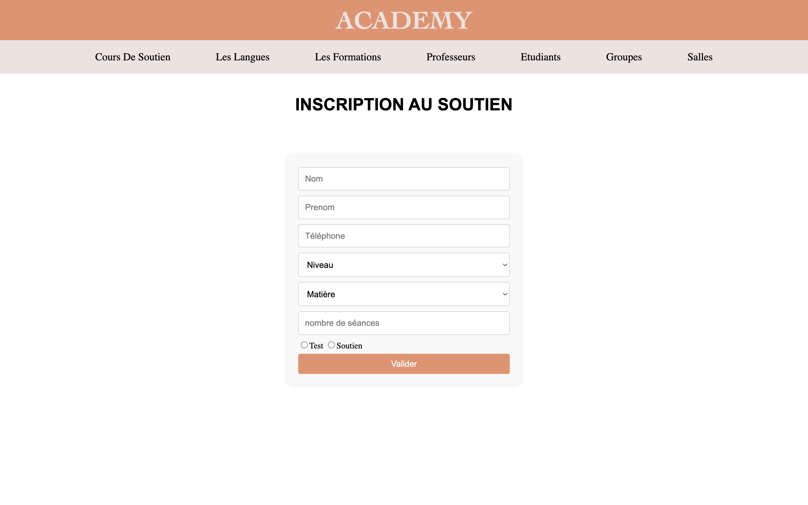
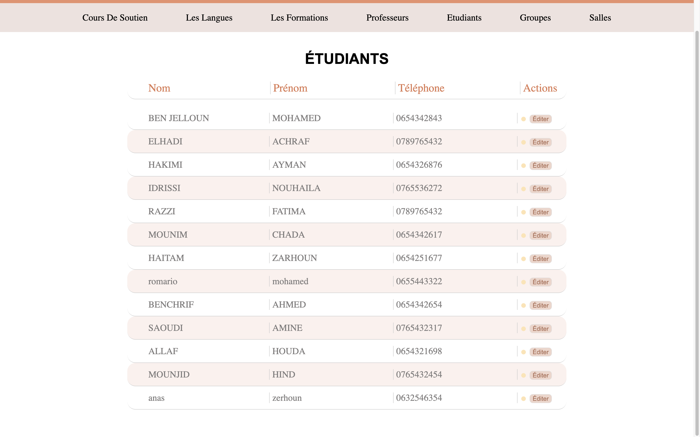
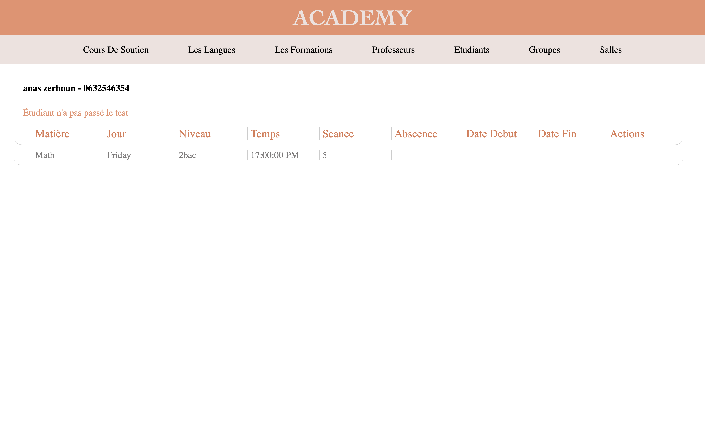
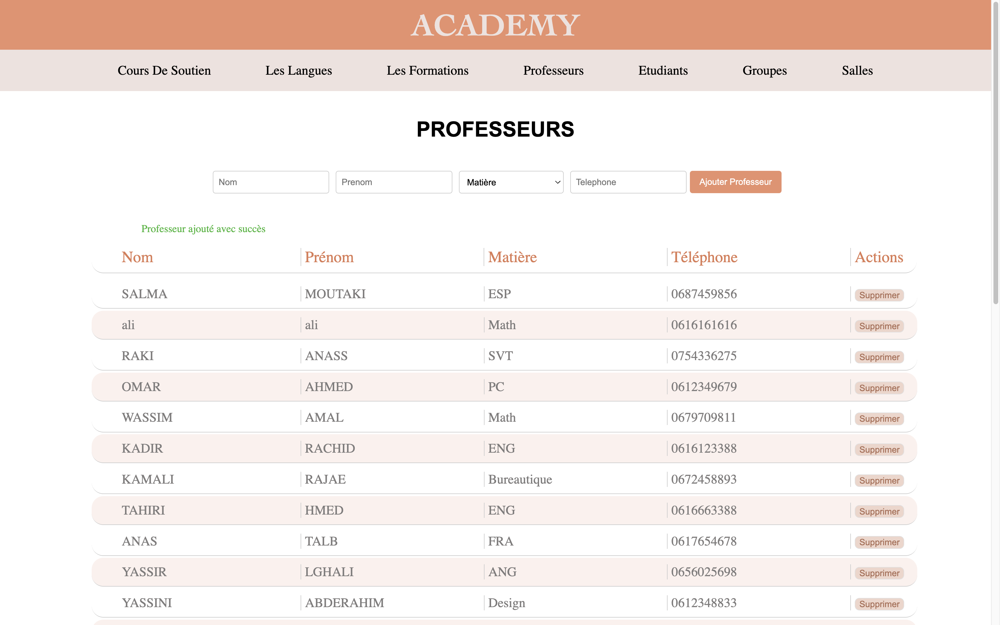
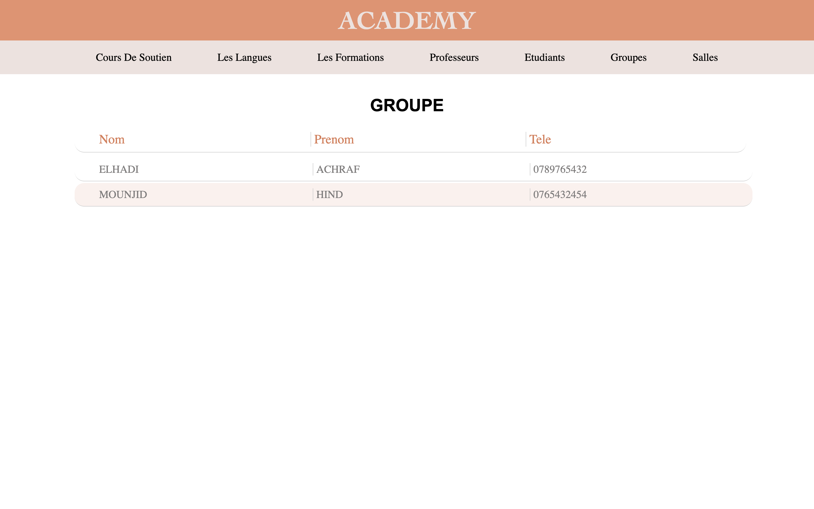
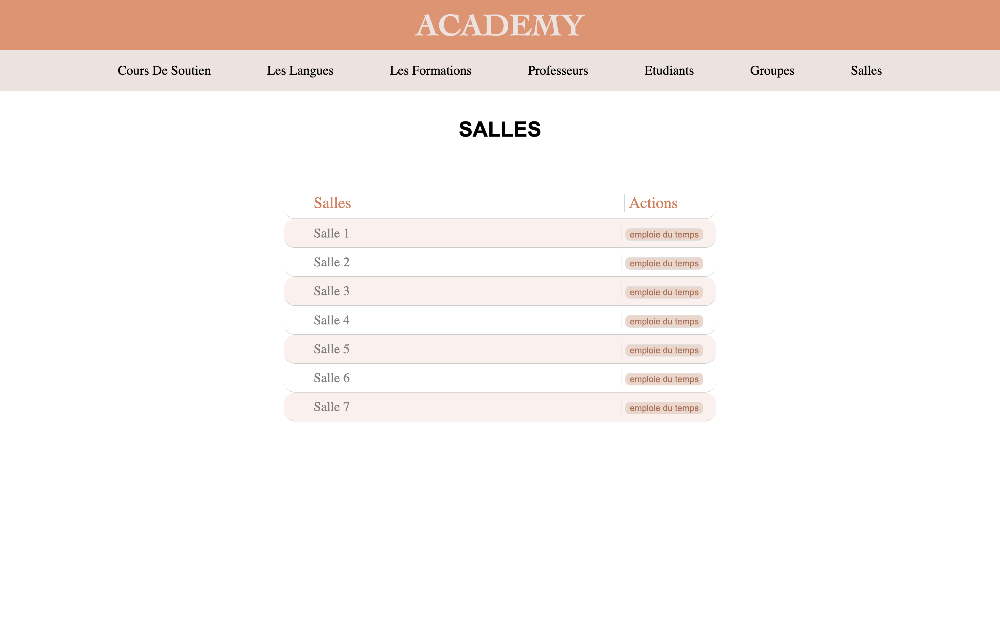
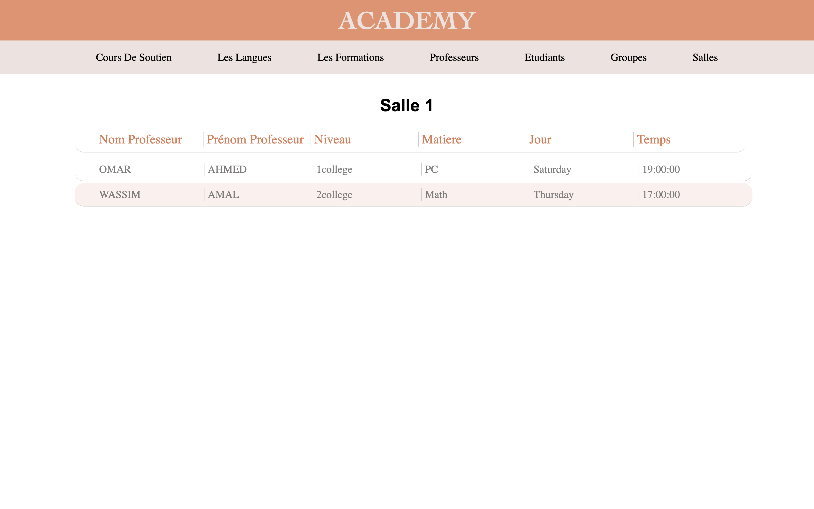

# projet : Centre de Formation

Ce projet est développé dans le cadre du module Systèmes d’Information & Bases de Données Relationnelles pour les étudiants de Génie Informatique à l'ENSA Khouribga. Il s'agit d'une application web destinée à la gestion d'un centre de formations (cours de soutien, langues, et autres formations) par les administrateurs du centre.

## Fonctionnalités

### Inscription des étudiants :
Formulaire d'inscription rempli par le personnel du centre pour enregistrer les étudiants.
### Gestion des professeurs :
Affichage de la liste des professeurs.   
Ajout d'un nouveau professeur.   
Suppression d'un professeur existant.
### Gestion des étudiants inscrits  :
Affichage de la liste des étudiants inscrits.   
Indication du statut de paiement des étudiants.   
Consultation des groupes attribués à chaque étudiant.
### Gestion des groupes :
Affichage des groupes créés avec leurs informations détaillées (type de formation, professeur, temps, et jour).
### Gestion des salles :
Affichage des salles disponibles.
Emploi du temps du centre : affichage des groupes pour chaque salle par jour et heure.

## Technologies Utilisées

- Backend : PHP
- Base de Données : MySQL
- Frontend : HTML, CSS

    
    
    
    
    
    
    

